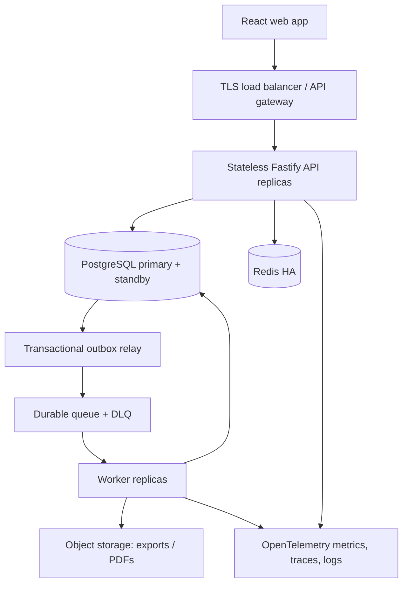

# Lazy Pygmy Inventory Suite — Node.js Backend Architecture Plan

**Status:** Proposed architecture
**Prepared:** 20 August 2026
**Scope:** Backend plan for the supplied React/Vite prototype; no backend implementation is included in this document.

## 1. Executive decision

Build the first production backend as a **TypeScript modular monolith** with two independently scalable processes:

1. a stateless Fastify HTTP API; and
2. an asynchronous worker for notifications, exports, reconciliation, and PDF generation.

Use **PostgreSQL as the system of record**, **Redis for server-side sessions, rate limits, and short-lived caches**, and a durable queue fed through a **transactional outbox**. Deploy multiple API replicas behind a load balancer, but keep inventory writes in one strongly consistent PostgreSQL region at first.

The core inventory model must not copy the current frontend's `product.qty` field into a database. Instead, it must use:

- explicit quantity states such as `AVAILABLE`, `RESERVED`, `COMMITTED`, `QUALITY_CONTROL`, and `DAMAGED`;
- an append-only stock movement ledger;
- a fast current-balance projection;
- reservations that prevent double-booking;
- idempotency keys on stock-changing commands; and
- short ACID transactions with deterministic row locking.

This design directly addresses the seven requested concerns: performance, scalability, caching and sessions, overload, API security, fault tolerance, and latency under data/user growth.

## 2. What was found in the supplied project

The ZIP contains a React 18/Vite single-page application. It has no API layer, database, or real authentication. Data is stored as browser arrays under `lp_*` local-storage keys.

### 2.1 Domain surface already present

The routes and mock data imply these backend domains:

- identity, employees, roles, and permissions;
- products, categories, suppliers, and supplier products;
- warehouses and warehouse inventory;
- purchase orders and goods receipts;
- sales orders, fulfillment, deliveries, and returns;
- adjustments, transfers, stock movements, and low-stock alerts;
- schools/customers and credit information;
- notifications, reports, analytics, and settings.

### 2.2 Correctness gaps the backend must close

| Frontend behavior | Production risk | Required backend rule |
|---|---|---|
| A pending adjustment immediately overwrites `product.qty`. | Unapproved stock becomes authoritative. | A draft/submitted adjustment changes no stock. Only an approved `POST` transition writes ledger and balance entries. |
| A submitted transfer immediately reduces the product quantity. | Stock can disappear before approval; no destination/location balance exists. | Reserve at approval, move source stock to in-transit at dispatch, and add destination stock only at receipt. |
| A goods receipt is saved, then products are updated in a separate operation. | A crash can create a receipt without stock, or stock without a receipt. | Receipt, PO-line totals, quantity states, ledger entries, audit record, and outbox event commit in one database transaction. |
| A return decision and stock changes are separate browser writes. | Restock/write-off and credit state can disagree. | Approve, disposition, stock movement, and credit-note request are coordinated transactionally; finance notification is emitted through the outbox. |
| Products contain one warehouse string and one quantity. | The same SKU cannot be represented correctly across multiple warehouses. | Product master data is separate from inventory at each warehouse/bin and quantity state. |
| Order price, discount, delivery fee, credit, and totals are calculated by the client. | A caller can tamper with price or bypass credit/availability rules. | The server reloads price, policy, customer credit, and availability, then calculates authoritative totals. |
| Roles are selectable on registration and permissions are checked in React. | A user could self-register as an administrator or call hidden actions directly. | Registration never accepts a privileged role. The API enforces role and object/warehouse scope on every operation. |
| Authentication is an `lp_auth` local-storage flag. | Any browser script/user can impersonate a signed-in user. | Use a server-side session and an `HttpOnly`, `Secure`, `SameSite` cookie; never place the session secret in browser storage. |

The current constants (`$44` discount, `$35` delivery charge, and `$890` sample credit) should be treated as prototype fixtures, not hard-coded production policy. Store pricing and credit policies as versioned business configuration and snapshot the applied values onto each order.

## 3. Public large-system patterns and how they apply

This plan uses public engineering material rather than assuming access to proprietary internals.

| Public source | Pattern observed | Application to Lazy Pygmy |
|---|---|---|
| [Amazon Science: evolution of Amazon's inventory planning system](https://www.amazon.science/latest-news/the-evolution-of-amazons-inventory-planning-system) | High-dimensional, capacity-constrained inventory decisions are decomposed into smaller problems and evaluated across fulfillment centers. | Keep warehouse/location an explicit partition key. Make availability queries local to a warehouse or region and decompose planning/reporting work into bounded jobs. |
| [Amazon Science: reworked fulfillment network](https://www.amazon.science/news-and-features/how-amazon-reworked-its-fulfillment-network-to-meet-customer-demand) | Regionalized, more self-sufficient fulfillment networks reduce distance and coordination complexity; rollout was measured and reversible. | Start in one region, but carry `organization_id` and `warehouse_id` through keys/events so a later cell-per-region or organization split is possible. Use feature flags and reversible migrations. |
| [Shopify inventory quantity states](https://shopify.dev/docs/apps/build/orders-fulfillment/inventory-management-apps/manage-quantities-states) | On-hand inventory is composed of explicit states such as available, committed, reserved, damaged, safety stock, and quality control; changes carry reasons. | Model quantity buckets and reason-coded transitions. Do not represent inventory as one mutable number. |
| [Microsoft Dynamics 365 Inventory Visibility reservations](https://learn.microsoft.com/en-us/dynamics365/supply-chain/inventory/inventory-visibility-reservations) | Soft reservations reduce available-to-promise stock without prematurely changing physical stock and use reservation identifiers. | Create expiring reservation records and move `AVAILABLE → RESERVED`; consume or release them through explicit commands. |
| [Square Catalog API](https://developer.squareup.com/docs/catalog-api/what-it-does) | Batch operations reduce round trips, large collections are paginated, and idempotency protects writes. | Provide bounded batch availability/catalog endpoints, cursor pagination, and mandatory idempotency keys for business writes. |
| [AWS transactional outbox guidance](https://docs.aws.amazon.com/prescriptive-guidance/latest/cloud-design-patterns/transactional-outbox.html) | Writing business data and publishing an event as two operations creates dual-write inconsistency. | Insert the business change and an outbox row in the same PostgreSQL transaction; relay later and make consumers idempotent. |
| [AWS overload guidance](https://builder.aws.com/content/3EukISjbJAGNdrxjKaN6RG0wlHG/avoiding-overload-in-distributed-systems-by-putting-the-smaller-service-in-control), [load shedding](https://builder.aws.com/content/3Eun1EEyX6p2e3VYNyRLSJzLuMV/using-load-shedding-to-avoid-overload), and [backoff with jitter](https://builder.aws.com/content/3EumjoZascWd1oZiEgL8ORlv3qE/timeouts-retries-and-backoff-with-jitter) | Admission control, bounded work, load shedding, timeouts, and randomized backoff prevent retry storms and cascading failure. | Bound request, database, and queue work; reject excess load with `429/503`; retry only safe operations at one layer with a small capped budget and full jitter. |

The lesson is **locality, explicit state, bounded work, and idempotent transactions**—not "start with dozens of microservices." A modular monolith preserves the cross-domain transactions this project needs while allowing modules and workers to scale independently.

## 4. Target architecture



### 4.1 Recommended stack

| Layer | Choice | Reason |
|---|---|---|
| Runtime | Current supported Node.js LTS, pinned by major and container digest | Stable security support; non-blocking I/O fits an API/worker workload. Upgrade through tested majors. |
| Language | TypeScript in strict mode | Shared domain types, safer refactoring, and generated API contracts. |
| HTTP framework | Fastify 5 with JSON Schema/TypeBox schemas | Fastify compiles request validation and response serialization; response schemas also reduce accidental data exposure. See [Fastify validation and serialization](https://fastify.dev/docs/latest/Reference/Validation-and-Serialization/). |
| SQL access | Kysely or Drizzle plus `node-postgres`; SQL migrations checked into Git | Transparent SQL, explicit indexes/locks, and strong TypeScript types. Avoid hiding critical stock transactions behind opaque ORM behavior. |
| System of record | Managed PostgreSQL, single writer, multi-AZ standby | Foreign keys, check constraints, transactions, row locks, point-in-time recovery, and later read replicas/partitioning. |
| Cache/session/limits | Managed Redis with replication and automatic failover | Low-latency session lookup, distributed rate counters, cache-aside reads, and short-lived coordination. It is never the inventory source of truth. |
| Async work | SQS on AWS, or another durable queue, with a PostgreSQL outbox relay | Separates user latency from notifications, exports, PDF rendering, and reconciliation without a dual write. |
| Object storage | S3-compatible encrypted bucket | Receipts, reports, exports, and attachments with short-lived signed access. |
| Contracts | OpenAPI 3.1 generated from route schemas | One source for validation, client types, examples, and contract tests. |
| Observability | OpenTelemetry plus centralized logs, metrics, traces, and alerting | Correlates browser request, API transaction, outbox event, and worker job. |

### 4.2 Deployment shape

- Run at least two API replicas across failure zones in production.
- Keep API processes stateless; do not use process memory for sessions, idempotency, queues, or authoritative caches.
- Run outbox relay and workers separately so PDF/report spikes cannot starve stock mutations.
- Give interactive stock commands a separate worker/connection budget from low-priority reporting.
- Use a single strongly consistent database region initially. Add a warm disaster-recovery region, not active-active stock writers.
- Introduce read replicas only for explicitly stale-tolerant reports. Availability and post-write reads remain on the primary.

### 4.3 Module boundaries

```text
src/
  modules/
    identity/        users, roles, permissions, sessions, password reset
    catalog/         products, categories, pricing, supplier products
    warehouses/      warehouses, bins, access scope
    inventory/       quantity states, ledger, availability, reservations
    procurement/     purchase orders, approvals, receipts
    transfers/       transfer lifecycle and in-transit stock
    sales/           customers/schools, orders, allocation, fulfillment
    returns/         inspection, disposition, credit request
    notifications/   inbox rules and delivery jobs
    reporting/       projections, exports, receipt PDFs
    audit/           immutable security and business audit trail
  platform/
    db/ cache/ queue/ http/ security/ observability/
```

Each module owns its tables and application commands. Cross-module calls happen through typed application interfaces; modules do not update one another's tables ad hoc. The API and worker import the same domain packages.

## 5. Data model

### 5.1 Identity and tenancy

Use UUIDv7 internal identifiers for index locality and separate human references such as `PO-2026-0117`.

| Table | Important fields/constraints |
|---|---|
| `organizations` | `id`, `code`, `name`, `timezone`, `currency`; seed one Lazy Pygmy organization now. |
| `users` | `id`, `organization_id`, normalized unique email/username, Argon2id password hash, status, `permissions_version`, timestamps. |
| `roles`, `permissions`, `user_roles`, `role_permissions` | Database-backed RBAC. System roles can be locked. Privileged role assignment requires an authorized administrator. |
| `user_warehouse_scopes` | Optional allowed warehouse IDs for warehouse managers, storekeepers, and delivery staff. |
| `password_reset_challenges` | User ID, hashed/HMAC-protected six-digit code, expiry, attempt count, consumed time; never store the code in plaintext. |
| `audit_logs` | Actor, action, object type/ID, before/after metadata, IP/session/correlation ID, time; append-only and access-restricted. |

Put `organization_id` on every business table and every uniqueness/index key even while only one organization exists. This enables future isolation and prevents cross-organization object access.

### 5.2 Catalog and parties

| Table | Important fields/constraints |
|---|---|
| `products` | `id`, `organization_id`, unique SKU, name, category, unit of measure, status, reorder policy, timestamps, version. No stock quantity column. |
| `product_prices` | Product, price type, currency, amount `numeric(19,4)`, effective range, version. |
| `categories` | Organization-scoped hierarchy and status. |
| `suppliers`, `supplier_products` | Supplier master, payment terms, lead time, supplier SKU, cost and minimum order. |
| `customers` | Represents the current schools; code, credit limit, payment terms, status, contact data. |
| `warehouses`, `warehouse_bins` | Code, region, capacity, state, manager, optional bin hierarchy. |

Never use IEEE floating point for money. Use `numeric(19,4)` in PostgreSQL and decimal arithmetic in Node. Store timestamps as `timestamptz` in UTC and apply the organization timezone only for display.

### 5.3 Inventory core

| Table | Purpose and key |
|---|---|
| `inventory_quantities` | Current projection keyed by `(organization_id, product_id, location_id, state)`, with non-negative `quantity` and `version`. |
| `inventory_movements` | Append-only ledger: product, source/destination location and state, quantity, unit cost snapshot, movement type, reason code, source document/line, actor, correlation ID, idempotency key, occurrence time. |
| `inventory_reservations` | Order/transfer line, product, location, quantity, status, expiry, reservation reference, version. |
| `inventory_adjustments`, `inventory_adjustment_lines` | Draft/approval/posting workflow and expected/counted quantities; stock changes only at `POSTED`. |
| `inventory_reconciliation_runs` | Ledger-to-projection comparison results, discrepancies, and resolution references. |

Recommended quantity states:

- `AVAILABLE` — sellable and allocatable now;
- `RESERVED` — soft reservation for an order or approved transfer;
- `COMMITTED` — physically allocated/picking/packed;
- `QUALITY_CONTROL` — received but unavailable pending inspection;
- `DAMAGED` — physically present but not sellable;
- `SAFETY_STOCK` — deliberately withheld;
- `IN_TRANSIT` — held at a virtual transfer location until receipt.

Define:

```text
on_hand = AVAILABLE + RESERVED + COMMITTED + QUALITY_CONTROL + DAMAGED + SAFETY_STOCK
available_to_promise = AVAILABLE
projected_available = AVAILABLE + confirmed_incoming - active_reservations_due_before_date
```

`IN_TRANSIT` and purchase-order `incoming` are not on-hand at the destination. Keep every state non-negative with database check constraints.

### 5.4 Business documents

Use header/line tables for `sales_orders`, `purchase_orders`, `receipts`, `transfers`, `returns`, and `credit_notes`. A line snapshots SKU/name, unit, price or cost, taxes/discounts, and policy version so historical documents do not change when catalog data changes.

Add:

- `idempotency_keys` with unique `(organization_id, operation_scope, key)` and request hash;
- `outbox_events` with event ID, aggregate, type, payload, occurred time, publish attempts, and published time;
- `notification_inbox` plus delivery attempts;
- `report_jobs` and `document_artifacts` for asynchronous exports/PDFs.

### 5.5 Essential constraints and indexes

- Unique: `(organization_id, sku)`, warehouse code, supplier code, customer code, human document number, and external/idempotency reference.
- Balance lookup: primary key `(organization_id, product_id, location_id, state)`.
- Ledger history: `(organization_id, product_id, location_id, occurred_at DESC, id DESC)` including source/reason fields.
- Orders/POs: `(organization_id, status, created_at DESC, id DESC)`.
- Active reservations: partial index by product/location/expiry where status is active.
- Unpublished outbox: partial index `(created_at, id)` where `published_at IS NULL`.
- Notification inbox: `(user_id, read_at, created_at DESC, id DESC)`.
- Use trigram/full-text PostgreSQL indexes for catalog search first; add a separate search engine only when measured requirements exceed it.
- Partition the append-only movement/audit tables by month only after size/query evidence justifies it (for example, tens of millions of rows). Premature partitioning increases operational work.

For large lists, use keyset/cursor pagination on a stable tuple such as `(created_at, id)`, not deep `OFFSET`. PostgreSQL can use a matching B-tree for ordered `LIMIT` queries; see [indexes and ordering](https://www.postgresql.org/docs/current/indexes-ordering.html).

## 6. Core transaction algorithms

### 6.1 Generic quantity-state transfer

Every stock change is a transfer between quantity buckets or between an external party and a bucket.

```text
command(state transfers[], document, idempotencyKey):
  1. Validate syntax and authorization before opening a DB transaction.
  2. Begin transaction; claim idempotency key and compare request hash.
  3. Sort all (organization, product, location, state) keys lexicographically.
  4. SELECT required quantity rows FOR UPDATE in that exact order.
  5. Re-check document version, workflow state, and source quantities.
  6. Decrement each source and increment each destination; reject negatives.
  7. Append balanced movement rows with reason, actor, source line, and correlation ID.
  8. Update the business document and version.
  9. Insert audit and outbox rows.
 10. Persist the idempotent response and commit.
 11. Publish asynchronously from the outbox.
```

For `k` document lines, sorting lock keys is `O(k log k)` and the mutation is `O(k)` indexed row operations. Sorting gives all writers the same lock order, reducing deadlocks. PostgreSQL row locks block competing writers rather than ordinary readers; see [explicit locking](https://www.postgresql.org/docs/current/explicit-locking.html).

Use `READ COMMITTED` plus explicit row locks for ordinary bucket transfers. Use `SERIALIZABLE` for multi-row invariants that cannot be safely expressed with locks/constraints, and retry SQLSTATE `40001` a small bounded number of times. PostgreSQL notes that serializable transactions can require retries: [transaction isolation](https://www.postgresql.org/docs/current/transaction-iso.html).

### 6.2 Idempotency

Require `Idempotency-Key` for creating orders, receipts, approved adjustments, transfer dispatch/receipt, return disposition, and other stock-changing commands.

- Same key + same normalized request hash: return the recorded status/body.
- Same key + different hash: return `409 IDEMPOTENCY_KEY_REUSED`.
- Concurrent same-key call: wait briefly for the first transaction or return a retryable conflict.
- Retain keys for at least the longest client retry window; retain financial/stock keys longer according to audit policy.

This makes browser double-clicks, network retries, and worker redelivery safe.

### 6.3 Reservation algorithm

Within one transaction:

1. Lock all requested `AVAILABLE` rows in deterministic order.
2. Check the requested quantity against `AVAILABLE` and product/customer rules.
3. Move quantity `AVAILABLE → RESERVED` and create reservation records with expiry.
4. On picking, move `RESERVED → COMMITTED`; on shipment, move `COMMITTED → external/customer`.
5. On cancellation/expiry, move `RESERVED → AVAILABLE` exactly once.

An expiry worker scans by indexed `expires_at`, claims rows with `FOR UPDATE SKIP LOCKED`, processes bounded batches, and is idempotent. This prevents double-booking without a distributed Redis lock.

### 6.4 Reconciliation algorithm

Incrementally and nightly compute ledger totals grouped by product/location/state and compare them with `inventory_quantities`.

- Raise a critical alert on any mismatch.
- Do not silently "repair" a balance; create a reviewed corrective adjustment.
- Track the last verified ledger ID so routine runs scan only new partitions, with periodic full verification.
- Verify document totals against movements and verify that every movement has a valid source document or approved system reason.

## 7. Workflow state machines

| Workflow | Allowed sequence | Inventory effect |
|---|---|---|
| Adjustment | `DRAFT → SUBMITTED → APPROVED → POSTED` or `REJECTED` | Only `POSTED` changes a bucket and writes the ledger. |
| Purchase order | `DRAFT → SUBMITTED → APPROVED → PARTIALLY_RECEIVED → RECEIVED`, with controlled cancellation | Approval changes no on-hand stock. Each GRN atomically moves external stock to `QUALITY_CONTROL` or `AVAILABLE`. |
| Transfer | `DRAFT → SUBMITTED → APPROVED → DISPATCHED → RECEIVED`, with reject/cancel paths | Approval reserves source; dispatch moves `RESERVED(source) → IN_TRANSIT`; receipt moves `IN_TRANSIT → AVAILABLE/QUALITY_CONTROL(destination)`. |
| Sales order | `DRAFT → SUBMITTED → RESERVED → PICKING → PACKED → DISPATCHED → DELIVERED`, with controlled cancellation | Reserve, commit, and ship through state transfers; never subtract one loose quantity field. |
| Return | `REQUESTED → INSPECTION → APPROVED/REJECTED → DISPOSITIONED → CREDITED` | Sellable items go external/customer → `AVAILABLE`; damaged items go external/customer → `DAMAGED`; credit is a separate auditable outcome. |

Store allowed transitions in domain code and test the transition matrix. Every command requires the expected document version (`If-Match`/version) so stale browser tabs cannot overwrite newer state.

## 8. HTTP API plan

Base path: `/api/v1`. Generate an OpenAPI document and a typed React client from the same route schemas.

### 8.1 Identity

```text
POST   /auth/register                 # pending/basic role only, or invitation-based
POST   /auth/login
POST   /auth/logout
GET    /auth/me
GET    /auth/sessions
DELETE /auth/sessions/:sessionId
POST   /auth/password/forgot
POST   /auth/password/code/verify     # six-digit challenge
POST   /auth/password/reset
```

Forgot-password always returns the same public response whether the account exists. A six-digit code has only one million combinations, so use a 10-minute proposed TTL, maximum five attempts, a resend cooldown, one active challenge per account, strict per-IP/account limits, and generic errors. Successful verification issues a short-lived single-use opaque reset grant. Password reset consumes it and revokes all existing sessions.

### 8.2 Master data and reads

```text
GET/POST       /products
GET/PATCH      /products/:id
GET            /products/:id/history
GET/POST       /categories
GET/POST       /suppliers
GET/PATCH      /suppliers/:id
GET/POST       /warehouses
GET/PATCH      /warehouses/:id
GET/POST       /customers
GET/PATCH      /customers/:id
POST           /inventory/availability:batch   # bounded SKU/location batch
GET            /inventory/balances
GET            /inventory/movements
```

### 8.3 Commands

```text
POST /sales-orders
POST /sales-orders/:id/submit
POST /sales-orders/:id/reserve
POST /sales-orders/:id/cancel
POST /sales-orders/:id/pick
POST /sales-orders/:id/dispatch

POST /purchase-orders
POST /purchase-orders/:id/submit
POST /purchase-orders/:id/approve
POST /purchase-orders/:id/receipts

POST /adjustments
POST /adjustments/:id/submit
POST /adjustments/:id/approve
POST /adjustments/:id/post

POST /transfers
POST /transfers/:id/submit
POST /transfers/:id/approve
POST /transfers/:id/dispatch
POST /transfers/:id/receive

POST /returns
POST /returns/:id/inspect
POST /returns/:id/approve
POST /returns/:id/disposition
```

Use command endpoints for meaningful state transitions. A generic `PATCH status=...` makes authorization, invariants, idempotency, and audit intent ambiguous.

### 8.4 Notifications, reports, and receipts

```text
GET    /notifications
PATCH  /notifications/:id/read
POST   /notifications/read-all
POST   /report-jobs                    # returns 202 + job ID
GET    /report-jobs/:id
GET    /report-jobs/:id/download       # short-lived signed URL
GET    /receipts/:id
POST   /receipts/:id/pdf               # idempotent async generation
GET    /receipts/:id/pdf
```

A receipt PDF must render from an immutable receipt snapshot, not from current product/supplier values. Store a content hash, template version, generation time, and artifact key. Keep PDF rendering out of the API event loop.

### 8.5 Contract conventions

- JSON only for normal APIs; uploads use explicit pre-signed object-storage flows.
- Cursor lists return `items` and `nextCursor`; cap `pageSize` (proposed maximum 100).
- Use `ETag`/`If-Match` or a body `version` for optimistic concurrency.
- Errors use `application/problem+json` with stable `type`, `code`, `status`, `detail`, `fieldErrors`, and `correlationId`, following [RFC 9457](https://www.rfc-editor.org/info/rfc9457/).
- Use `409` for state/idempotency conflicts, `412` for stale versions, `422` for valid JSON that violates business rules, `429` for caller limits, and `503` for global load shedding.
- Never trust client totals, inventory availability, role, organization, actor, document number, or audit fields.
- Bound all batches, strings, payload sizes, date ranges, and export row counts.

## 9. The seven requested engineering concerns

### 9.1 Performance

1. Validate and serialize with compiled schemas; reject malformed work before database access.
2. Keep stock transactions short, lock only required quantity rows, and perform email/PDF/report work after commit.
3. Add indexes from measured query shapes; capture slow-query plans and run `EXPLAIN (ANALYZE, BUFFERS)` against production-like data.
4. Avoid N+1 queries with bounded joins or batched lookups.
5. Use keyset pagination and select only fields required by each screen.
6. Batch availability requests by product/location instead of one request per row.
7. Use connection pooling with a global budget. Example: four API replicas × 15 connections plus workers × 10 must stay below the managed database limit and reserve capacity for migrations/operations. Add PgBouncer when replica count makes direct pools inefficient.
8. Compress text responses at the edge and use `ETag`/conditional GET for stable catalog/reference data.
9. Move CPU-heavy PDF rendering, large CSV generation, image processing, and bulk imports to workers. Node's guidance is to keep per-client event-loop work small: [Don't block the event loop](https://nodejs.org/en/learn/asynchronous-work/dont-block-the-event-loop).
10. Run password hashing in a capacity-limited auth path so Argon2 work cannot starve inventory traffic.

### 9.2 Scalability

Scale in this order:

1. vertical PostgreSQL capacity plus correct indexes;
2. horizontal stateless API replicas;
3. separately scaled worker pools and Redis cache;
4. movement/audit table partitioning and stale-tolerant read replicas;
5. warehouse/organization cells only when traffic, data, or team ownership requires them.

Carry `organization_id`, `region_id`, and `warehouse_id` in table keys, logs, metrics, and event partition keys from day one. If a hot organization/region later dominates, route it to its own cell with its own API, database, Redis, and queue. Do not shard before a measured limit; cross-shard transfers and global reporting are much harder than a well-tuned single PostgreSQL cluster.

Potential extraction order, only after evidence:

1. reporting/export worker;
2. notification delivery;
3. availability/reservation service if it needs independent scale and ownership;
4. search projection.

The inventory ledger remains the source of truth; extracted read services consume versioned events.

### 9.3 Cache and session management

#### Cache policy

| Data | Cache? | Proposed TTL/invalidation |
|---|---|---|
| Product/category/supplier detail | Yes | 5–15 minutes; invalidate from outbox after changes. |
| Dropdown/reference lists | Yes | 5–30 minutes; versioned namespace. |
| Dashboard/report aggregates | Yes | 30–120 seconds; label data timestamp. |
| Availability | Only as an optimization | 1–3 seconds and event invalidation; stock commands always validate in PostgreSQL. |
| Permissions | Briefly | Keyed by user and `permissions_version`; invalidate on role change. |
| Receipt/order/ledger writes | No authoritative cache | Read primary immediately after write; cache immutable completed receipts only. |

Use cache-aside: read Redis, fall back to PostgreSQL, populate with a randomized TTL. Add 10–20% TTL jitter, single-flight request coalescing for hot misses, and very short negative caching where safe to avoid a thundering herd. If Redis cache fails, bypass it and protect PostgreSQL with concurrency limits; do not fail inventory correctness.

#### Sessions

- Cookie: `__Host-lp_session`; `Secure`, `HttpOnly`, `SameSite=Lax` (or `Strict` if flows permit), `Path=/`, no `Domain`.
- Store only a cryptographically random opaque session identifier in the cookie; keep session data in Redis.
- Proposed defaults to confirm: 30-minute idle timeout, 12-hour absolute timeout, optional 7-day "remember me" with reauthentication for sensitive actions.
- Rotate the session ID at login, privilege change, password reset, and other authentication-level changes.
- Revoke the current session on logout and all sessions on password change, suspension, or suspected compromise.
- Maintain a per-user session index for "sign out other devices."
- If the session store is unavailable, fail authenticated commands closed with a retryable `503`; never accept stale unverifiable sessions.
- Add a session-bound CSRF token to every state-changing browser request. SameSite is defense in depth, not a CSRF replacement; see [OWASP session management](https://cheatsheetseries.owasp.org/cheatsheets/Session_Management_Cheat_Sheet.html) and [CSRF prevention](https://cheatsheetseries.owasp.org/cheatsheets/Cross-Site_Request_Forgery_Prevention_Cheat_Sheet.html).

### 9.4 Server overload

Use several bounded controls rather than one rate limit:

| Boundary | Control |
|---|---|
| Edge | Request/connection rate limits, bot/WAF rules, body-size limits, TLS termination. |
| Caller | Per-IP, account, organization, and route token buckets; very strict login/reset-code/export budgets. |
| API replica | Maximum in-flight requests, request deadlines, event-loop-lag guard, bounded parser memory. |
| Database | Small pool, bounded wait queue, statement/lock timeouts, slow-query kill/alert policy. |
| Queue | Bounded job payloads, visibility timeout, per-job deadlines, retry cap, dead-letter queue, maximum backlog alarms. |
| Business | Maximum page/batch/report date range, maximum order lines, maximum upload size, and export quotas. |

Priority order during degradation:

1. login/session validation and stock writes;
2. interactive availability and order/receipt reads;
3. catalog and dashboards;
4. exports, analytics refresh, PDF regeneration, and noncritical notifications.

When saturated, shed low-priority work early. Return `429` plus `Retry-After` when one caller exceeds its budget; return `503` plus `Retry-After` when the service is globally saturated. Do not allow an unbounded in-memory wait queue.

Retry only idempotent operations, serialization/deadlock failures, and known transient network failures. Use two or three attempts maximum with exponential backoff and full jitter. Put retries at one layer to avoid multiplicative storms. Circuit-break optional third-party email/SMS/object-storage calls and let queue jobs retry without holding API requests open.

### 9.5 API security

1. **Authentication:** server-side opaque sessions; Argon2id password hashes. OWASP recommends modern, slow salted hashes and provides Argon2id baseline configurations: [Password Storage Cheat Sheet](https://cheatsheetseries.owasp.org/cheatsheets/Password_Storage_Cheat_Sheet.html).
2. **Registration:** ignore any client-supplied role. New public accounts are `PENDING`/least privilege; privileged users are invitation- or admin-created.
3. **Authorization:** enforce action permission plus `organization_id` and allowed warehouse/customer scope for every object ID. OWASP identifies missing per-object checks as BOLA: [API1:2023](https://owasp.org/API-Security/editions/2023/en/0xa1-broken-object-level-authorization/).
4. **Input/output schemas:** reject unknown or oversized fields; use parameterized SQL; response schemas include only approved fields.
5. **Browser protections:** exact CORS origin allowlist with credentials, CSRF token on mutations, HSTS/CSP/frame/content-type/referrer headers, and TLS everywhere.
6. **Abuse controls:** rate/concurrency and record-return limits for every route, especially login, six-digit reset verification, search, exports, and PDF jobs. See [OWASP API4:2023](https://owasp.org/API-Security/editions/2023/en/0xa4-unrestricted-resource-consumption/).
7. **Secrets:** managed secret/KMS service, short-lived workload identity, rotation, no secrets in Git/logs/images.
8. **Audit:** immutable actor/action/object/result records for login, role changes, approvals, stock movements, exports, and security denials. Redact passwords, codes, cookies, tokens, and sensitive personal data.
9. **Files:** direct signed upload with size/type allowlist, malware/content validation before use, random object keys, private bucket, expiring downloads.
10. **Supply chain:** lockfiles, dependency/SBOM scan, secret scan, container scan, signed images, protected migrations, and timely supported-version upgrades.

### 9.6 Fault tolerance

- Multi-zone API replicas with readiness/liveness/startup probes and graceful connection draining.
- Managed PostgreSQL synchronous standby/failover, encrypted automated backups, point-in-time recovery, and quarterly restore drills.
- Redis replication/failover; cache outage degrades to protected database reads, while session outage fails authenticated operations closed.
- Transactional outbox eliminates database/event dual writes. Consumers store event IDs and are idempotent because queues can redeliver.
- Dead-letter queues retain poison jobs with actionable metadata; replay requires authorization and idempotency.
- Graceful degradation: reports can show the last refresh time, notifications may be delayed, and PDF/export can queue; stock correctness may not degrade.
- Health endpoints distinguish process liveness from dependency readiness. A replica that cannot reach required dependencies leaves load-balancer rotation.
- Graceful shutdown stops accepting requests, waits a bounded time for active transactions/jobs, then returns work to the queue.
- Daily automated reconciliation detects ledger/projection drift.
- Proposed service objectives to confirm: 99.9% monthly API availability, recovery point objective ≤5 minutes, recovery time objective ≤30 minutes. Business criticality and infrastructure budget must approve these numbers.

### 9.7 Request/response latency as users and data grow

These are **proposed server-side objectives**, not claims about the prototype or Liberia's last-mile network.

| Endpoint class | p95 | p99 | Design response when work exceeds budget |
|---|---:|---:|---|
| Availability batch (≤100 pairs) | 150 ms | 350 ms | Indexed primary lookup; no deep joins. |
| Catalog/detail/list | 200 ms | 500 ms | Cache stable reads; cursor pagination; bounded fields. |
| Stock-changing command | 350 ms | 800 ms | Short ACID transaction; async side effects. |
| Login/session | 350 ms | 900 ms | Capacity-limited Argon2 work and strict abuse control. |
| Report/export/PDF submission | 200 ms | 500 ms | Return `202`; job completes asynchronously with progress. |

Use Little's Law for admission planning: at 400 requests/second and 200 ms average service time, about 80 requests are in flight (`L = λW`). The configured concurrency limit must stay below the point at which database pool waits and event-loop lag rise sharply; load tests establish that point.

#### Growth validation envelope

| Stage | Test data/workload—not a guaranteed limit | Required measures |
|---|---|---|
| Initial | 10k products, 10 warehouses, 1m movements, 100 concurrent users | Correct indexes, 2+ API replicas, PostgreSQL primary/standby, Redis, worker. |
| Growth | 100k products, 100 warehouses, 20m movements, 500 concurrent users | Partition evidence review, PgBouncer if needed, report read replica/materialized views, autoscaled workers. |
| Large | 1m products, 1k warehouses, 200m movements, 2k concurrent users | Cell/shard feasibility review, CDC read projections, hot-key analysis, archive policy, dedicated availability service only if justified. |

Run tests at all three dataset sizes so query complexity remains bounded. Latency should depend on requested page/batch size, not total table size.

## 10. Observability and operations

Every request receives a `correlationId`; propagate it to database application name/comment, outbox event, queue job, logs, traces, and the error response.

### 10.1 Golden signals

- rate, p50/p95/p99 latency, error rate, and saturation per route/organization;
- active requests, event-loop lag, heap/GC, CPU, and worker-thread utilization;
- DB pool in-use/wait time, query duration, lock/deadlock/serialization retries, replication lag, disk and transaction age;
- Redis hit rate, latency, evictions, memory, failover, session lookup failure;
- queue depth/age, retry/DLQ count, outbox unpublished age;
- reservation expiry lag, receipt/transfer processing time, inventory reconciliation mismatches;
- cache staleness and report refresh time.

Use RED metrics for APIs, USE metrics for infrastructure, and business correctness alarms. A zero error rate is not sufficient if queue age or database wait time is rising.

### 10.2 Alert examples

- stock command p95 above 350 ms for 10 minutes;
- error rate above 1% or any repeated `500` on stock commands;
- DB pool wait p95 above 50 ms or utilization above 80%;
- event-loop lag above 100 ms;
- oldest unpublished outbox event above 60 seconds;
- queue age above its job SLO;
- any reconciliation mismatch;
- Redis evictions or session failure spike;
- replica lag above the reporting freshness contract.

## 11. Testing strategy

### 11.1 Correctness

- Unit tests for every state transition and permission.
- Property tests: quantities never become negative; every internal movement is balanced; idempotent repeats produce one effect.
- Integration tests against real PostgreSQL/Redis containers, including concurrent reservation, receipt, transfer, and cancellation races.
- Contract tests generated from OpenAPI for both success and `problem+json` responses.
- Migration tests on a production-size anonymized/seed dataset.

### 11.2 Performance and failure

Use k6 or equivalent with a representative mix: 70% reads, 20% order/reservation actions, 5% receipts/transfers/returns, and 5% auth/report submissions. Run:

- baseline and capacity ramp;
- sudden traffic spike;
- 8–24 hour soak for leaks/connection exhaustion;
- hot-SKU contention test;
- large-catalog and deep-history tests;
- duplicate/reordered request and event delivery;
- PostgreSQL failover, Redis loss, queue delay, worker crash, and object-store/email outage;
- retry-storm and abusive reset-code scenarios.

The release fails if p95/p99, error, saturation, reconciliation, or recovery objectives fail. Do not average away tail latency.

## 12. Frontend integration and migration

1. Add one typed API client and repository layer; React routes must not call `fetch` independently.
2. Replace `RequireAuth` local-storage checks with `GET /auth/me` and cookie credentials.
3. Add a CSRF header interceptor and global handling for `401`, `403`, `409`, `412`, `422`, `429`, and `503`.
4. Replace `localStorageStore` module by module behind stable hooks, starting with read-only catalog and ending with stock commands.
5. Treat seed data as development fixtures loaded by database migrations/scripts. Do not silently upload every user's browser local storage.
6. If real user-entered prototype data exists, build an administrator-only offline export/import tool with dry-run validation, duplicate detection, review, and one idempotent commit.
7. Use feature flags for each migrated domain and keep rollback paths until comparison tests pass.
8. Invalidate/remove legacy `lp_auth` and business keys after an explicit successful cutover; never mix local and server stock as two sources of truth.

## 13. Delivery phases and loop checks

Effort depends on team size and requirements; the exit gates are more important than calendar promises.

### Phase 0 — Requirements, SLOs, and threat model

- Confirm organizations, warehouses/bins, units of measure, cost method, tax/currency, approval thresholds, registration policy, credit behavior, offline needs, RPO/RTO, and data-retention rules.
- Record architecture decisions and API naming/error conventions.
- Produce load model and test datasets.

**Loop check:** product, operations, finance, security, and frontend owners sign off invariants and state machines. Rework unresolved rules before schema implementation.

### Phase 1 — Platform and identity

- Repository, TypeScript/Fastify, configuration validation, PostgreSQL migrations, Redis, OpenAPI, observability, CI/CD.
- Users, invite/registration, login/logout, sessions, roles/scopes, forgot/code/reset flow, audit foundation.

**Loop check:** security tests, role/object-denial tests, session rotation/revocation, rate-limit tests, migration rollback, and basic load baseline all pass.

### Phase 2 — Catalog and inventory kernel

- Products/suppliers/warehouses/customers.
- Quantity states, ledger, availability batch, reservations, adjustment posting, idempotency, reconciliation.

**Loop check:** concurrent property/integration tests prove no negative or double-booked stock; ledger equals projection after injected failures and retries.

### Phase 3 — Operational workflows

- Purchase orders and atomic receipts.
- Transfers and in-transit state.
- Sales order allocation/fulfillment.
- Returns/disposition and credit request events.

**Loop check:** every transition, stale-version conflict, partial receipt, partial fulfillment, cancel/retry, and cross-warehouse race passes end-to-end tests.

### Phase 4 — Async work, notifications, and reporting

- Transactional outbox, queue, idempotent workers, DLQ.
- Notification inbox/delivery, report projections, exports, immutable receipt PDFs/object storage.
- Cache-aside reads and event invalidation.

**Loop check:** delayed/duplicate/out-of-order events do not duplicate effects; cache outage and worker crashes preserve correctness; artifact access expires correctly.

### Phase 5 — Scale, overload, security, and recovery hardening

- Production-size indexes/plans, load/shedding thresholds, autoscaling, HA/backup/restore, observability dashboards and runbooks.
- OWASP API threat review, dependency/container/secrets scans, authorization matrix, penetration test.

**Loop check:** spike/soak/hot-SKU/failover/restore tests meet agreed SLO/RPO/RTO with no reconciliation mismatch.

### Phase 6 — React migration and cutover

- Generated client, domain-by-domain feature flags, seed/import, error and retry UX, remove local-storage authority.
- Shadow/compare read outputs before each module switches; canary production rollout.

**Loop check:** frontend contract/E2E/accessibility tests, business acceptance, telemetry, and rollback exercise pass. Only then retire legacy storage.

At the end of every phase, repeat: **inspect evidence → test invariants → measure SLOs → review security/operations → fix gaps → rerun the complete gate**. A phase is complete only when the rerun is green.

## 14. Recommended audit fixes, prioritized

### P0 — before any production use

- Replace local-storage authentication and client-only authorization.
- Prevent self-selection of privileged roles during registration.
- Introduce the ledger, per-location quantity states, reservations, and atomic stock transactions.
- Require idempotency and optimistic version checks for business writes.
- Move all authoritative totals, credit, availability, document numbering, and actor identity to the server.
- Add input/output schemas, object-level authorization, CSRF protection, exact CORS, rate/resource limits, secrets management, and security audit logging.
- Establish backups, restore testing, outbox, reconciliation, and monitoring.

### P1 — required for reliable launch

- Cursor pagination, query indexes, async reports/PDFs, queue/DLQ, cache policy, connection/concurrency budgets.
- Multi-zone API/DB/Redis, graceful shutdown, load shedding, timeout/retry policy.
- Contract, concurrency, load, soak, failover, and recovery tests.
- Data retention, privacy, attachment scanning, audit access and export controls.

### P2 — after measured growth

- Movement/audit partitioning, PgBouncer, reporting replica/materialized projections.
- Regional/organization cells, dedicated availability service, external search, or CDC projections only when metrics justify them.
- Advanced forecasting/replenishment optimization should be a separate planning service consuming trusted inventory events, not part of the transactional API request path.

## 15. Decisions still requiring business confirmation

1. Is registration public, invitation-only, or administrator-created?
2. Are products tracked only by warehouse, or also bin, batch/lot, serial number, and expiry date?
3. Is negative inventory ever allowed? This plan recommends **no**.
4. Which cost method is required: weighted average, FIFO, standard cost, or another accounting policy?
5. When does sales stock become reserved, and how long can a reservation live?
6. What approval thresholds and segregation-of-duties rules apply to adjustments, POs, transfers, returns, and exports?
7. Is quality inspection mandatory for receipts and returns?
8. What are the real peak users, SKU count, warehouse count, daily movements, report sizes, availability SLO, RPO, and RTO?
9. Are email/SMS providers and integrations in scope, or only an in-app notification inbox?
10. Are Liberia-only deployment/data-residency constraints applicable?

These answers tune policy and capacity, but they do not change the core recommendation: a strongly consistent ledger, explicit inventory states, atomic commands, idempotency, bounded work, and stateless horizontal API scaling.

## 16. Primary references

- [Amazon Science — The evolution of Amazon's inventory planning system](https://www.amazon.science/latest-news/the-evolution-of-amazons-inventory-planning-system)
- [Amazon Science — How Amazon reworked its fulfillment network](https://www.amazon.science/news-and-features/how-amazon-reworked-its-fulfillment-network-to-meet-customer-demand)
- [Shopify — Manage inventory quantities and states](https://shopify.dev/docs/apps/build/orders-fulfillment/inventory-management-apps/manage-quantities-states)
- [Microsoft Dynamics 365 — Inventory Visibility reservations](https://learn.microsoft.com/en-us/dynamics365/supply-chain/inventory/inventory-visibility-reservations)
- [Square — Catalog API patterns](https://developer.squareup.com/docs/catalog-api/what-it-does)
- [AWS — Transactional outbox pattern](https://docs.aws.amazon.com/prescriptive-guidance/latest/cloud-design-patterns/transactional-outbox.html)
- [AWS Builders' Library — Avoiding overload](https://builder.aws.com/content/3EukISjbJAGNdrxjKaN6RG0wlHG/avoiding-overload-in-distributed-systems-by-putting-the-smaller-service-in-control)
- [AWS Builders' Library — Using load shedding](https://builder.aws.com/content/3Eun1EEyX6p2e3VYNyRLSJzLuMV/using-load-shedding-to-avoid-overload)
- [AWS Builders' Library — Timeouts, retries, and backoff with jitter](https://builder.aws.com/content/3EumjoZascWd1oZiEgL8ORlv3qE/timeouts-retries-and-backoff-with-jitter)
- [PostgreSQL — Transaction isolation](https://www.postgresql.org/docs/current/transaction-iso.html), [explicit locking](https://www.postgresql.org/docs/current/explicit-locking.html), [partitioning](https://www.postgresql.org/docs/current/ddl-partitioning.html), and [high availability](https://www.postgresql.org/docs/current/high-availability.html)
- [Fastify — Validation and serialization](https://fastify.dev/docs/latest/Reference/Validation-and-Serialization/)
- [Node.js — Don't block the event loop](https://nodejs.org/en/learn/asynchronous-work/dont-block-the-event-loop)
- [OWASP API Security — BOLA](https://owasp.org/API-Security/editions/2023/en/0xa1-broken-object-level-authorization/) and [resource consumption](https://owasp.org/API-Security/editions/2023/en/0xa4-unrestricted-resource-consumption/)
- [OWASP — Session Management](https://cheatsheetseries.owasp.org/cheatsheets/Session_Management_Cheat_Sheet.html), [CSRF Prevention](https://cheatsheetseries.owasp.org/cheatsheets/Cross-Site_Request_Forgery_Prevention_Cheat_Sheet.html), and [Password Storage](https://cheatsheetseries.owasp.org/cheatsheets/Password_Storage_Cheat_Sheet.html)
- [RFC 9457 — Problem Details for HTTP APIs](https://www.rfc-editor.org/info/rfc9457/)
